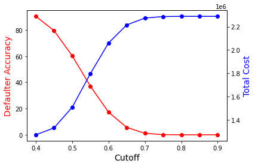

# Credit Risk Analysis and Modeling

## Prerequisites

Python packages required: pandas, numpy, skleaern, matplotlib, seaborn, scorecardpy

## Objective

Built a scorecard for a Brazil bank to minimize credit risk by analyzing credit card application profiles.

## Steps:

1. Load data

The data is from a local Brazil bank with 50,000 credit card application records with 53 independent variables. The response variable is a binary 0 or1 indicating whether an applicant defaults or not.

2. Data cleaning

In this study, many methods were developed to deal with missing values. The details are in the attached article. 

3. Feature Engineering

Several new features are created, such as summing up similar features together and getting the average value for each group.
Since there are more than 50 features, feature selection is necessary to avoid overfitting and redundant information. Instead of using PCA, weight of evidence (WoE) and Imformation value (IV) are used for feature selection. Details about how to use them can be found in the attached article.

4. Modeling

Logistic regression, random forest and XGBoost are used for prediction. Imbalance is a big issue for this study. Thus, in the model, "class_weight" is set as "balanced" to assign heavier penalty to the minority class in the loss function. Meanwhile, confusion matrix and ROC-AUC are used for model evaluation.

5. Two cutoff point strategy

Below are the defaulter accuracy and total cost for each cutoff point (threshold) from 0.4 to 0.9. The default accuracy is high and the overall cost is cheap when the cutoff point is less than 0.5. As a result, applications with a defaulter probability of less than 0.5 should be authorised as soon as possible. When the cutoff value is higher than 0.6, the defaulter accuracy declines, while the bank's total cost skyrockets. As a result, applications having a defaulter probability greater than 0.6 should be rejected immediately. Auditors or specialists should be included in the decision-making process if the application's defaulter probability is between 0.5 and 0.6.

